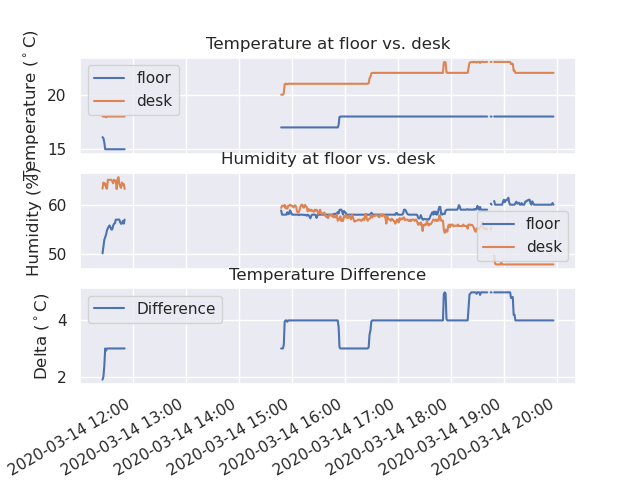

# Multiple Temperature Sensors

This simple project was put together to observe the temperature difference between the floor and desk level in my home office.

It reads the temperature and humidity sensors every 10 seconds and logs the readings to a file called `temp_log.csv`.

# Hardware

The system this software is written for is as follows:

* Raspberry Pi 3 running Raspbian 10.3 (buster)
* I2C 16x2 LCD - https://wiki.52pi.com/index.php?title=1602_Serial_LCD_Module_Display_SKU:Z-0234
* 2 x DHT 11 Temperature / Humidity sensors

# Software requirements

The software is written in Python3.

## DHT (Temperature / Humidity) sensor drivers

The DHT uses adafruit drivers and can be installed using the following:

```
sudo pip3 install RPI.GPIO
sudo pip3 install adafruit-blinka
sudo pip3 install adafruit-circuitpython-dht
sudo apt-get install libgpiod2
```

# Installation

## Installation commands

The following are required to be installed for the various components of the system.

First run

```
sudo apt-get update
```


| Component | Purpose | Installation commands |
| --- | --- | --- |
| PIP | python installer | `sudo python3 -m pip install --upgrade pip` |
| RPI.GPIO | Hardware interface | `sudo pip3 install RPI.GPIO` |
| Adafruit drivers | used by sensors | `sudo pip3 install adafruit-blinka` |
| DHT | Humidity / Temp sensor | `sudo pip3 install adafruit-circuitpython-dht`<br>`sudo apt-get install libgpiod2`|
| SQLite | database| `sudo apt-get install sqlite3`|
| Flask | webserver| `sudo apt-get install python3-flask`|
| Pandas | data wrangling|`sudo pip3 install pandas`|
| Matplot | graphing|`sudo pip3 install matplotlib`|
| Seaborn | graph styling|`sudo apt-get install libatlas3-base`<br>`sudo pip3 install seaborn`|

## Warnings / Errors

Use ` --ignore-installed` flag on any of the pip3 install commands if 

```
It is a distutils installed project and thus we cannot accurately determine which files belong to it which would lead to only a partial uninstall.
```

error occurs.

It may be necessary to use this script if there are problems with libgpiod:

https://github.com/adafruit/Raspberry-Pi-Installer-Scripts/blob/master/libgpiod.sh


# Running 

To start it running (and be able to close the terminal and leave it running):

```
nohup ./multi_temp.py &
```

To stop it running in the background:

```
ps ax | grep multi_temp.py
kill PID
```

# Graphing the readings




Running

```
python3 graph.py
```

will generate a set of graphs and save them as a file called `temp.png`.


# Diagnostic Testing

The following scripts can be used to check that things are working:

| Script | Purpose |
| --- | --- |
| `python3 lcd_ip_address.py` | Displays the WiFi SSID and the Rasperberry Pi's IP address. |
| `python3 lcd_hello.py` | Display a Hello World message to check that LCD is functioning. |
